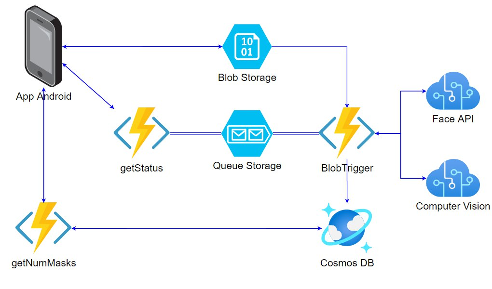
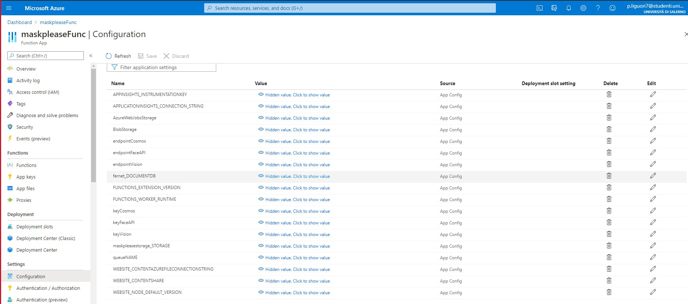

# MaskPleaseGame
MaskPleaseGame è un'applicazione Android ideata per la prevenzione al contagio da Covid-19, adottando le logiche della Gamification.
A tal proposito introduciamo il concetto di RepuScore. In cosa consiste? Se, uscendo di casa, viene scattato una selfie con la mascherina indossata entro 15 minuti.

Il menu Photo sarò sbloccato solamente quando vi è un effettivo spostamento: in tal caso potrai accedervi con un Tap dalla scheramata principale o alternativamente pigiando la notifica di avviso appena apparsa.
Repuscore un punteggio che misura il tuo senso civico. Il tuo obiettivo consiste nel mantenerlo il più alto possibile. Come? Semplicemente scattando un selfie mentre indossi la mascherina appena esci di casa: l'intelligenza artificiale la riconoscerà e ti assegnerà dei RepuPoint. Non dimenticare di farlo altrimenti il tuo RepuScore inizierà a scendere!

<p align="center"></p>

MaskPleaseGame fornisce le seguenti funzionalità:

- notifica sul cellulare che ricorda di portare la mascherina dopo uscita di casa;
- assegnazione punti reputazione se utente invia foto con mascherina dopo uscita di casa;
- condivisione dei propri punti reputazione con altri utenti;
- visualizzazione del numero di mascherine indossate globalmente.

## Architettura
L’utente carica una foto, in cui indossa la mascherina, all’interno del Blob Storage, il quale memorizza l’immagine dandole un nome univoco . Quindi, una volta caricata l’immagine all’interno del BlobStorage si attiva il trigger della funzione BlobTrigger e viene eseguito il codice al suo interno. Essa invia l’immagine ricevuta ai servizi Computer Vision e Face, i quali analizzano l immagine e rispondono alla funzione in modo affermativo o negativo a secondo che nella foto sia presente o meno una persona con mascherina. In caso affermativo incrementa poi il numero di mascherine indossate globalmente in quella data collegandosi con il servizio di Cosmos DB, in particolare API SQL. Dopodichè, tale funzione invia un messaggio contentente “Mascherina OK” o “Mascherina NO” alla coda. Entra poi in gioco la funzione getStatus, la quale viene chiamata tramite polling http lato client e che recupera il messaggio all’interno della coda per poi fornire una risposta al client. Infine troviamo la function gectNumMasks chiamata dal client, che recupera il numero di mascherine indossate in data odierna e restituisce il dato al client.
<p align="center"></p>


Questo tutorial ha lo scopo di mostrare come sia possibile sfruttare le potenzialità dei servizi di Azure per sviluppare un'app android.
Il tutorial mostra anche come fare l'host del codice in Azure.
#### Struttura del tutorial

* **[Prerequisiti](#prerequisites)**
* **[Configurazione risorse](#resources)**
* **[Esecuzione](#execution)**

## Prerequisiti
- [An Azure Subscription](https://portal.azure.com/)
- Node.js


## Configurazione risorse
In questa sezione viene proposto un tutorial per la creazione di tutte le risorse Azure richieste, usando il portale di Azure. Al fine di mantenere il costo il più basso possibile verrà scelto il piano gratuito quando disponibile.

**PROMEMORIA** Ogni risorsa su Cloud necessita di un tempo di implementazione che in alcuni casi può essere piuttosto lungo, sii paziente.

### Resource Group
Per prima cosa è necessario un Azure Resource Group, che è abbastanza semplice da creare tramite portale di Azure.
**ATTENZIONE** La regione selezionata deve essere la stessa per tutte le risorse rimanenti.


### Storage Account
[Storage Account](https://docs.microsoft.com/en-us/azure/storage/common/storage-account-overview) è il servizio di Azure che consente di archiviare ogni tipo di oggetto dati. 
E'stato utilizzato per memorizzare temporaneamente le foto contententi persone che indossano la mascherina.
Utilizzo del portale di Azure:
1. Creare una nuova risorsa urilizzando la barra di ricerca e cercare 'Storage account'.
2. Fornire i dettagli per Subscription, Resource Group, nome e Location. 
3. Lasciare i campi rimanenti come da default.

### Cognitive Services
[Cognitive Services](https://docs.microsoft.com/en-us/azure/cognitive-services/what-are-cognitive-services) è un servizio di Azure che consente di integrare intelligenza cognitiva all'interno di un'applicazione. Nello sviluppo di questa applicazione vengono utilizzati i seguenti Azure Cognitive per rilevare la mascherina al volto:<br/>
-Face API<br/>
Rileva e identifica persone ed emozioni nelle immagini. Inoltre, è in grado di riconoscere accessori come la mascherina, motivo per il quale è stato utilizzata
 Dal portale Azure fare click su "Create new Resource" e cercare "Face". Proseguire con i passaggi indicati.<br/>
-Computer Vision<br/>
 Descrive il contenuto delle immagini che analizza. Viene eseguito nel caso Face dovesse fallire con il riconoscimento del viso, Vision è l'ultima risorsa per la detection della sola mascherina.  
 Dal portale Azure fare click su "Create new Resource" e cercare "Computer Vision". Proseguire con i passaggi indicati.

### Cosmos DB
[CosmosDB](https://docs.microsoft.com/en-us/azure/cosmos-db/introduction) è un database NoSQL offerto dai servizi Azure per lo sviluppo di app moderne, offrendo tempi di risposta veloci e scalabilità automatica.
Cosmos DB mantiene json che tengono traccia del numero di mascherine totali indossate dagli utenti giorno per giorno.
Utilizzo del portale di Azure:
1. Creare una nuova risorsa utilizzando la barra di ricerca e cercare 'Azure Cosmos DB'.
2. Specificare "serverless" per la voce "Capacity mode".
3. Settare "Core(SQL)" per la voce "API".
4. Confermare la creazione della risorsa.

### Function App
[Azure Function App](https://docs.microsoft.com/en-us/azure/azure-functions/functions-overview) è il servizio Serverless Computing offerto da Azure che permette di eseguire blocchi di codice denominati <<function>>.
Essendo la nostra architettura di completa natura serverless, utilizziamo 3 functions che gestiscono la logica di back-end.
1. Creare una nuova risorsa utilizzando la barra di ricerca e cercare 'Function App'.
2. Fornire i dettagli per Subscription, Resource Group e nome. 
3. Selezionare Node.js come 'Runtime stack', scegliere la Regione e lasciare i restanti campi come da default.
Quando la risorsa è stata correttamente installata, aprire la risorsa.
1. Nel menu laterale scegliere 'Functions' e creare una nuova function usando il bottone 'Add'.
2. Selezionare il 'Template Blob trigger' e inserire un nome per la function.
3. Nel menu laterale della stessa pagina scegliere 'Code+test', sostituire il codice con quello all'interno del file index.js all'interno della cartella BlobTrigger1.
4. Selezionare i template HttpTrigger sia per getStatus che per GetNumMask e ripetere come nel passo precedente.
5. Nel menu della risorsa Function App, dirigersi in Settings > Configuration e creare le application Settings come nella figura seguente, accoppiando ai seguenti nomi le relative keys ed endpoint delle risorse create in precedenza.
6. Sempre menu laterale della Function App, cliccare su Development Tools > Advanced Tool. 
7. Aprire la Power Shell di Kudu e sostiture il contenuto di C:\home\site\wwwroot\package.json con quello di package.json di questo repository.
9. Eseguire dalla Power Shell "npm install"

<p align="center"></p>

#### Esecuzione
1. Zip up the code directory manually. Make sure that you are in the bot's project folder, the one that contains index.js file. Select **ALL** the files and folders before running the command to create the zip file, make sure to include also the _.env_ file that can be hidden, in this case use CTRL+H to show it. If your root folder location is incorrect, the bot will fail to run in the Azure portal.
2. Open terminal inside the folder
```sh
$ az webapp deployment source config-zip --resource-group "<resource-group-name>" --name "<name-of-web-app>" --src "<project-zip-path>"
```
3. Wait for the deploy, it might take a while.

#### [Deploy on Microsoft Teams](https://docs.microsoft.com/en-us/azure/bot-service/channel-connect-teams?view=azure-bot-service-4.0)
Go to the Bot Channels Registration resource using the Azure Portal.
1. In the lateral menu choose 'Channels'.
2. Select the Microsoft Teams icon in 'Add a feature channel' section to create a new channels for Microsoft Teams.
3. Close the created channel and return in 'Channels' page. Click on 'Microsoft Teams', that will open a conversation with the bot inside Microsoft Teams app.
**The might take a while to be ready**

**Authors**
ISISLab - Università degli Studi di Salerno
- Pierluigi Liguori
- Fabiano Priore

